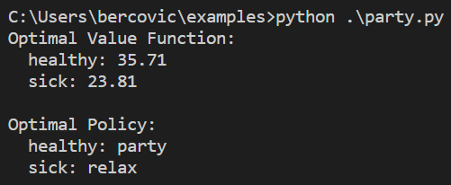

# Value iteration for MDPs (val_iteration)

val_iteration is a Python library that implements the value iteration algorithm for computing the optimal policy and value of an MDP. This package provides a valid implementation for MDPs where actions have stochastic effects, and rewards are dependent on the final state, but can be easily adapted to simpler cases. The code is based on the algorithm presented in Chapter [9.5.2](https://artint.info/2e/html2e/ArtInt2e.Ch9.S5.SS2.html) of [Artificial Intelligence: Foundations and Computational Agents 2nd edition](https://artint.info/2e/html2e/ArtInt2e.html).

## Installation

The only requirement is to use any Python version at least above 3.12 (included). More importantly, there are no dependencies on other packages.

The simplest way to install this package is by using the package manager pip in your preferred programming environment.


```python
pip install "git+https://github.com/VBercoV/val_iteration"
```

Once the package is installed, it can be straight-forwardly imported within the same IDE.


```python
import val_iteration
```

## How to use

This version requires very specific data types for each user-defined element of the MDP, and this is crucial information for the implementation to work.

- states: must be defined as a list of strings, where each string represents a state of the MDP from the set of states S.


```python
states = ['healthy', 'sick']
```

- actions: must be defined as a dictionary where, for each key-value pair, the key is a state of the MDP, and the value is a list of all available actions from that state, represented as strings.


```python
actions = {
    'healthy': ['relax','party'],
    'sick': ['relax','party'] 
}
```

- transitions: must be defined as a dictionary where, for each key-value pair, the key is a state-action pair (s,a), and the value is a list of tuples (prob, next_state), such that prob represents the probability that next_state is the effect of stochastic action a at initial state s.


```python
transitions = {
    ('healthy', 'relax'): [(0.95, 'healthy'), (0.05, 'sick')],
    ('healthy', 'party'): [(0.7, 'healthy'), (0.3, 'sick')],
    ('sick', 'relax'): [(0.5, 'healthy'), (0.5, 'sick')],
    ('sick', 'party'): [(0.1, 'healthy'), (0.9, 'sick')]
}
```

- rewards: must be defined as a dictionary where, for each key-value pair, the key is a state-action-next_state pair (s,a,s'), and the value is the associated reward R(s,a,s'). If rewards are independent of next state - in the form R(s,a) -, then simply assign the same value for all effects s' of stochastic action a at state s.


```python
rewards = {
    ('healthy', 'relax', 'healthy'): 7,
    ('healthy', 'relax', 'sick'): 7,
    ('healthy', 'party', 'healthy'): 10,
    ('healthy', 'party', 'sick'): 10,
    ('sick', 'relax', 'healthy'): 0,
    ('sick', 'relax', 'sick'): 0,
    ('sick', 'party', 'healthy'): 2,
    ('sick', 'party', 'sick'): 2
 }
```

Once these are defined, one can use the value iteration implementation with default settings, and display the optimal policy and value function in an elegant way.


```python
V, policy = val_iteration.val_iteration(states, actions, transitions, rewards)

print("Optimal Value Function:")
for s in V:
    print(f"  {s}: {V[s]:.2f}")

print("\nOptimal Policy:")
for s in policy:
    print(f"  {s}: {policy[s]}")
```

But what are the "default settings" here? Essentially, these are 3 values concerned with the iteration algorithm and termination:

- gamma: Discount factor $\gamma$. By default set to 0.8
- theta: Convergence threshold $\theta$. Iteration ends when $max_{s \in S}|V_{k+1}(s) - V_k(s)| < \theta$. By default set to $10^{-6}$
- nr_iter: Maximum number of iterations. Must be non-zero. By default set to 100000.

These can also be modified depending on the requirements of the problem.


```python
gamma = 0.9
theta = 1e-5
nr_iter = 10000

V, policy = val_iteration.val_iteration(states, actions, transitions, rewards, gamma, theta, nr_iter)
```

## Examples

To provide an even better understanding of the implementation, we also provide a folder with 2 [examples](https://github.com/VBercoV/val_iteration/tree/main/examples) where the MDP is set up and then the value iteration algorithm is applied.

The first example, party.py, is taken from Example [9.27](https://artint.info/2e/html2e/ArtInt2e.Ch9.S5.html#Ch9.Thmciexamplered27) in [Artificial Intelligence: Foundations and Computational Agents 2nd edition](https://artint.info/2e/html2e/ArtInt2e.html). This is a simple MDP which models whether a student should party or relax over the weekend to avoid being sick, yet extract maximum enjoyment. For this example, running the [code](https://github.com/VBercoV/val_iteration/blob/main/examples/party.py) should reveal the exact answers as the theoretical values derived in the book, at Example 9.31 in Chapter [9.5.2](https://artint.info/2e/html2e/ArtInt2e.Ch9.S5.SS2.html).



The second example, gridworld.py, is taken from Example [9.28](https://artint.info/2e/html2e/ArtInt2e.Ch9.S5.html#Ch9.Thmciexamplered28) in [Artificial Intelligence: Foundations and Computational Agents 2nd edition](https://artint.info/2e/html2e/ArtInt2e.html). This MDP models a robot trying to move through (an idealization of) an environment, represented as a grid, collecting rewards along the way. Defining transitions and rewards turns out to be quite difficult, due to the data structure choice, but [not](https://github.com/VBercoV/val_iteration/blob/main/examples/gridworld.py) impossible.
